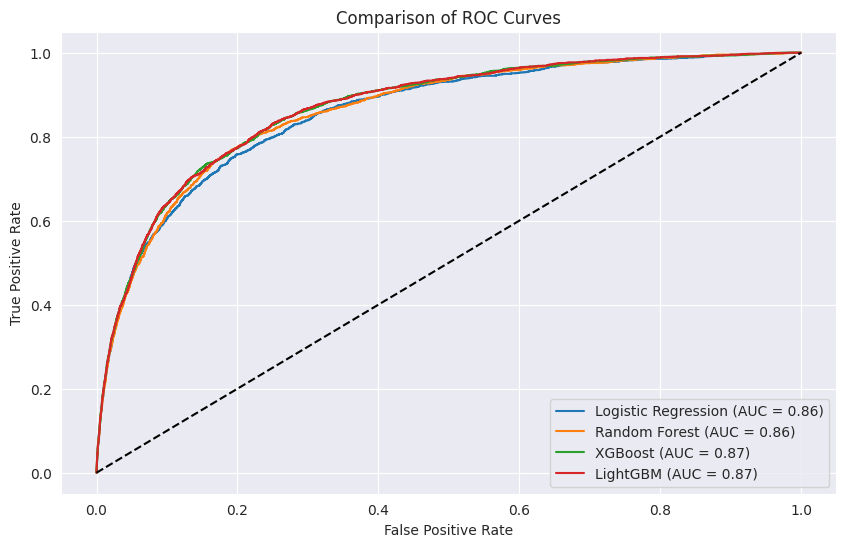
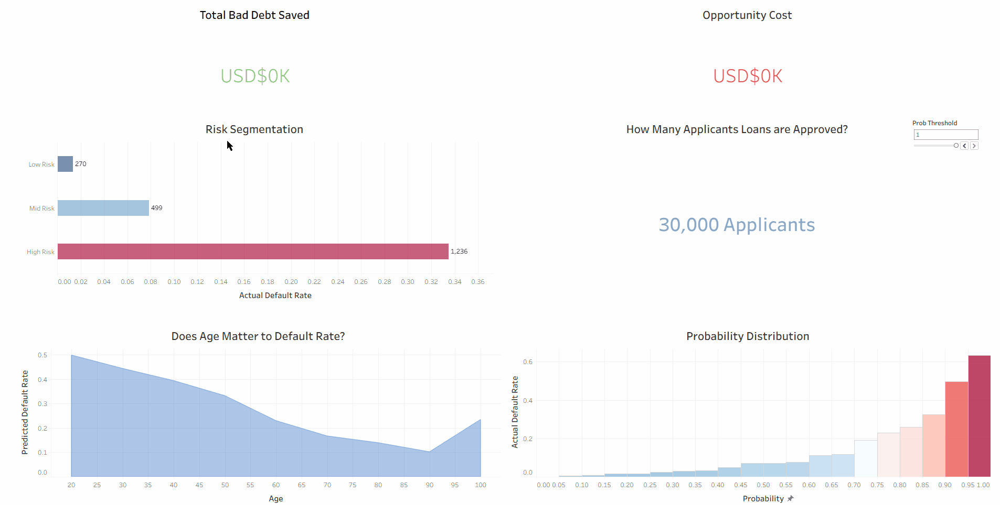

## Project Overview
This project aims to identify high-risk loan applicants and automate the loan approval workflow for financial institutions. Using the "Give Me Some Credit" dataset (150,000+ records), this project tackles real-world data challenges including severe class imbalance, missing data mechanics, and non-linear feature relationships. Compared LightGBM, XGBoost, Random Forest, and Logistic Regression to find the optimal balance between speed and precision.

## Exploratory Data Analysis (EDA): 
Beyond basic statistics, I performed deep-dive analysis into feature distributions:

* **Target Imbalance:** Identified that only ~6.7% of samples are positive (delinquent), necessitating robust sampling strategies.<p align="center"> </p>

* **Outlier Detection:** Utilized Interquartile Range (IQR) and histogram to filter for features like DebtRatio and RevolvingUtilizationOfUnsecuredLines to prevent model bias.
<p align="center"></p>

* **Correlation Analysis:** Utilized heatmaps to analyze feature correlations and identified the high correlation between delinquency history across different time windows (30-59 days vs 90+ days). This helps us to better understand what are the important features for the model training.
<p align="center"></p>

## Data Preprocessing and Feature Engineering:
* **Missing Value Imputation:** Missing Value Imputation: To maintain data density and prevent bias from row deletion, Median Imputation was applied to MonthlyIncome and NumberOfDependents, ensuring a robust dataset for model training.
* **Feature Transformation:** While tree-based models are robust to scale, features were analyzed for skewness; extreme values in MonthlyIncome and DebtRatio were processed using Log Transformation. Applied Log1p transformation to these features to handle zero values and normalize distribution for improved model convergence.

## Handling Unbalanced Data:
* **SMOTE:** Generated synthetic examples for the minority class in the high-dimensional feature space.
* **Cost-Sensitive Learning**: Instead of modifying the dataset (which can lead to overfitting or loss of information), I modified the Loss Function, implementing the calculation of the ratio of negative to positive samples.This forces the model to prioritize the "Recall" of delinquent borrowers, which is the primary KPI in credit risk.

The reason why I used two approaches to handle unbalanced data is because I noticed the SMOTE solution's result was not optimistic. Therefore, I used cost-sensitive learning approach to try enhacning the model performance, and it performed better than SMOTE approach.

## Model Architecture and Hyperparameter Tuning:
I utilized XGBoost for its exceptional handling of tabular data and built-in support for missing values.

```Python
models = {
    "Logistic Regression": LogisticRegression(class_weight='balanced',max_iter=1000,random_state=42),
    "Random Forest": RandomForestClassifier(n_estimators=130,max_depth=5,class_weight='balanced',random_state=42),
    "XGBoost": XGBClassifier(n_estimators=130,learning_rate=0.05,max_depth=5,scale_pos_weight=15,random_state=42),
    "LightGBM": LGBMClassifier(n_estimators=130, learning_rate=0.05, max_depth=5, scale_pos_weight=15, random_state=42, verbosity=-1)
}
```
* **Learning Rate ($0.05$):** A lower rate combined with sufficient estimators to ensure smooth convergence.

* **Max Depth ($5$):** Balanced complexity to capture non-linear interactions without overfitting to specific noise in the training set.

The optimal hyperparameters were found by **GridSearch** combined with manual fine-tuning, as automated searches occasionally lead to overfitting on training data.

## Result
### Model Comparison
In unbalanced credit scoring, Accuracy is a misleading metric. We focus on ROC-AUC and Recall as it is more reliable indicators for the model.

<div align="center">
  
</div>

<div align="center">

| Model | ROC-AUC | Recall | Note |
| :--- | :---: | :---: | :--- |
| **LightGBM** | **0.87** | **0.80** | **Champion: Best ranking ability and training speed.** |
| XGBoost | 0.87 | 0.79 | High performance, slightly slower than LightGBM. |
| Random Forest | 0.86 | 0.75 | Robust but less sensitive to minority class. |
| Logistic Regression | 0.86 | 0.72 | Linear baseline; highly interpretable. |

</div>

### Model Interpretability

To comply with financial regulations and build trust, I implemented SHAP to analyze feature contributions.

<p align="center"></p>


* **Total Past Due:** The most helpful predictor. Even a single past-due event significantly shifts the SHAP value towards the "Default" side.
* **Revolving Utilization of Unsecured Lines:** It is the second strongest predictor of default. High utilization suggests a borrower is "maxing out" their credit cards, indicating a liquidity crunch and immediate financial distress.
* **Age:** Younger borrowers tend to have more volatile income and less credit history, whereas older borrowers typically possess higher financial stability and wealth accumulation.

## Interactive Decision Dashboard

The model's output is a probability, but a business needs a Decision. I built a Tableau Dashboard to bridge this gap.



This Dashboard allows stakeholders to adjust the Probability Threshold (0.0 - 1.0) to see the immediate impact on:

**Bad Debt Saved (USD):** The potential loss avoided by rejecting high-risk applicants.

**Opportunity Cost (USD):** Potential interest revenue lost from "False Positives."

**Risk Segmentation:** Categorizes applicants into Low/Mid/High risk, providing a clear path for automated vs. manual credit review.

**Age Trend Analysis:** Visualized the inverse relationship between age and default probability, confirming the model's bias towards financial stability in older demographics.

For those who want to try on this Dashboard, here is the link for you:

[Tableau Dashboard](https://public.tableau.com/views/CreditRiskPredictionDashboard_17747759597830/1?:language=zh-TW&:sid=&:redirect=auth&:display_count=n&:origin=viz_share_link)

## Conclusion
By shifting from a static model to an interactive decision system, this project provides:

**Quantifiable ROI:** A clear estimate of bad debt reduction helping managers make the informed and data-driven decisions.

**Operational Efficiency:** Automated filtering of low-risk applicants while flagging high-risk cases for human audit.

**Model Explainability:** SHAP-based explanations for every model features, meeting modern fintech compliance standards.
